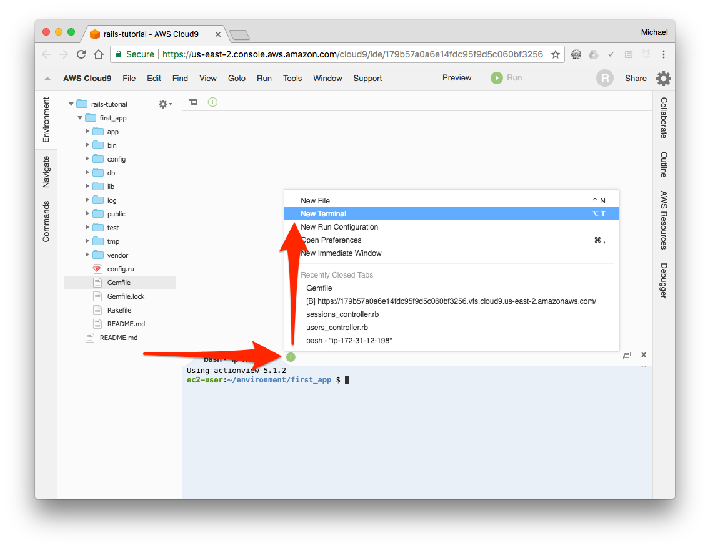
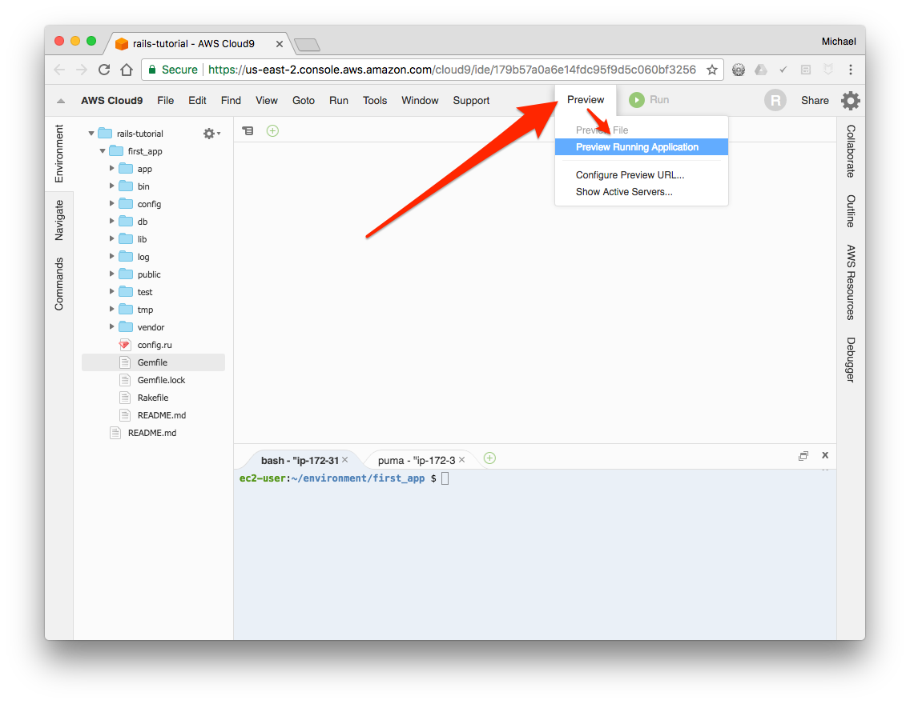
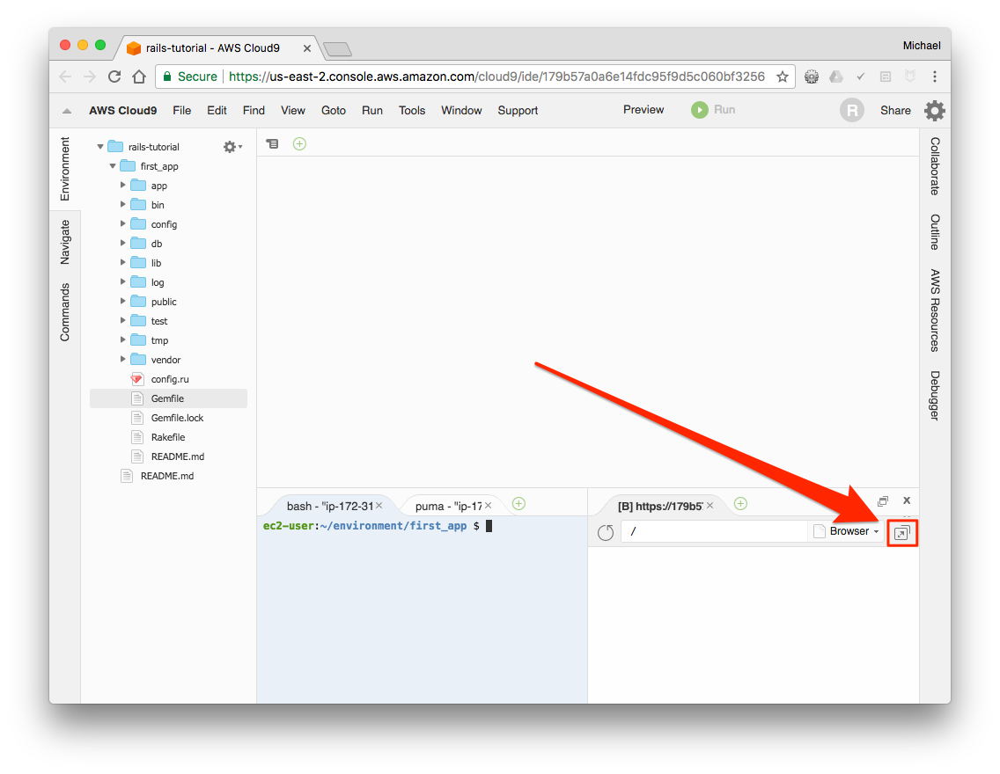
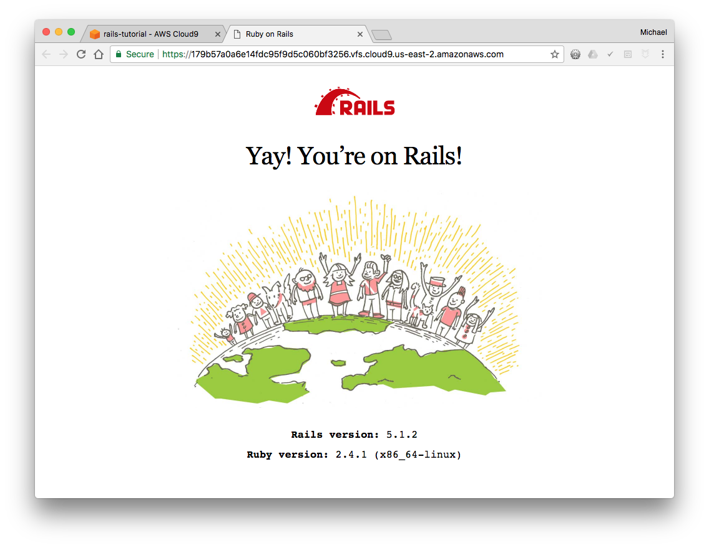

There are a couple differences between Cloud9 and a local environment. The
following tips and adjustments should help you through the curriculum.

# No vagrant
Cloud9 doesn't use vagrant, so you can skip any commands that include `vagrant`.

# Running the server
If a terminal is running your server with `rails server`, it won't accept any
other commands. You should open a new terminal tab to run the server, so you
can continue to run commands in your first terminal tab.

On the bottom of your editor is the console window. If you don't see the console
window, click **View > Console** from the top menu.

Click the small green **(+)** icon, and then click **New Terminal**.

Now you can run `rails server` here, and still issue commands in your first tab.

# http://localhost:3000 doesn't work in Cloud9
Because Cloud9 is a cloud environment, the server is running on Amazon, not
your computer. Wherever you see instructions to visit `http://localhost:3000`,
you should instead visit your personal Cloud9 preview URL. Here's how:

First, make sure your server is running.

From the top menu, click **Preview > Preview Running Application**.

A small window will appear to the right of the console. Click the indicated icon
to pop out the preview to a new browser tab.

You can now click the small **x** next to the preview tab to close it. Switch
to your new browser tab.

You will now be at your personal preview URL, and it will have the form:
`https://0881115cc5c34e93aba4a4cd03b99438.vfs.cloud9.us-east-1.amazonaws.com`

Initially, it should look something like this:

Whenever instructed to go to a URL beginning with `http://localhost:3000`,
you should replace `http://localhost:3000` with your personal preview URL.

---
Images from Michael Hartl's [Ruby on Rails Tutorial](https://www.railstutorial.org/book/beginning).
